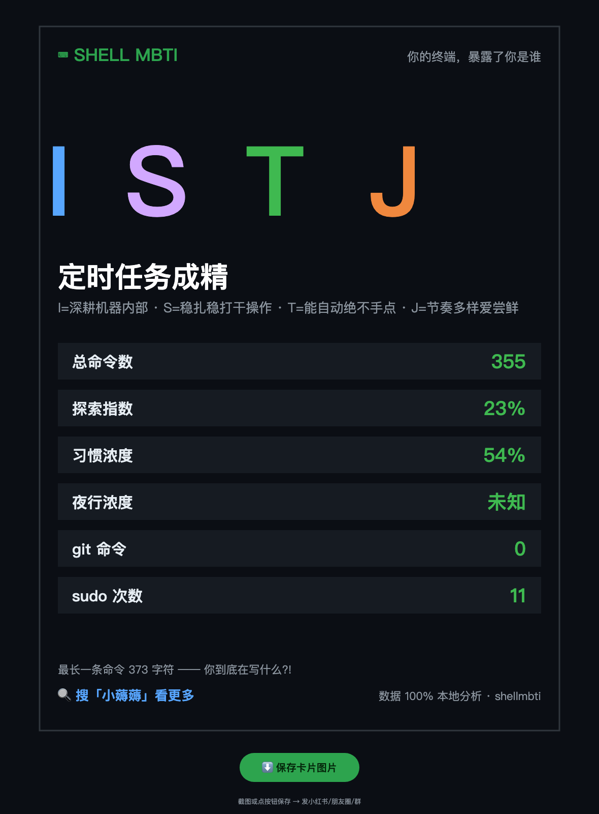

# ⌨ shellmbti

> **Your shell history exposes who you are.** One command → your Shell MBTI persona + a shareable card.

English | [简体中文](README.zh-CN.md)



## What

`shellmbti` reads your local shell history (zsh / bash / fish), analyzes it **100% offline**, and tells you:

- 🧠 **Your Shell MBTI** — 16 archetypes like *The Cron Job Reincarnate*, *The Silent Architect*, *The Night-shift Guardian*
- 📊 Real stats: total commands, exploration index, habit concentration, night-owl ratio, git concentration, sudo count, and your longest command (with judgment)
- 🎴 **A beautiful shareable card** (1080×1440, Xiaohongshu-perfect ratio) rendered locally via canvas — one click to save PNG

No API. No upload. No account. Your history never leaves your machine — nobody pastes their shell history into a random website. That's exactly why this must be a local tool.

## Why MBTI

Nobody reads dashboards, but everybody shares their personality result. The analysis uses transparent heuristics (command diversity → E/I, creative-vs-operational → N/S, automation → T/F, habit concentration → J/P). It's for fun — and honest about it.

## Quick start

```bash
git clone https://github.com/tomlen045/shellmbti.git
cd shellmbti
python3 shellmbti.py          # terminal persona report
python3 shellmbti.py --card   # generate the shareable card
```

Requirements: python3 (stdlib only, zero dependencies). Supports zsh (incl. extended-history timestamps), bash, fish.

## License

MIT

---

## 🫰 关注「小薅薅」· 每天发现一个宝藏工具

> **小薅薅** — 年轻人的赛博工具箱。每天为你发现一个好玩、实用、开源的小工具，帮你节省 1 小时探索时间。
>
> 📱 **微信搜索「小薅薅」** 或扫描下方二维码关注
>
> 后台回复关键词获取：
> - 回复 **「工具」** → 获取全部工具合集（离线可用）
> - 回复 **「运维」** → 获取运维/安全资源包
> - 回复 **「加群」** → 加入工具交流群

<div align="center">

| 🎯 更多作品 | 描述 | Stars |
|:---|:---|:---|
| [ops-skills](https://github.com/tomlen045/ops-skills) | 10个AI运维技能包，让Claude Code变成SRE专家 | [⭐ 新项目](https://github.com/tomlen045/ops-skills) |
| [ops-doctor](https://github.com/tomlen045/ops-doctor) | 一条命令给Linux服务器做全套体检+健康分 | [⭐ 实用工具](https://github.com/tomlen045/ops-doctor) |
| [naicha-mbti](https://github.com/tomlen045/naicha-mbti) | 8道题测出你的奶茶人格，生成分享卡片 | [🧋 爆款](https://github.com/tomlen045/naicha-mbti) |
| [fafa-generator](https://github.com/tomlen045/fafa-generator) | 发疯文学生成器——一键生成发疯文案+卡片 | [🔥 热门](https://github.com/tomlen045/fafa-generator) |
| [life-progress](https://github.com/tomlen045/life-progress) | 人生进度条——把你的时间摆在眼前 | [⏳ 走心](https://github.com/tomlen045/life-progress) |

</div>

<div align="center">

**觉得有用？给个 ⭐ 让更多人看到 → [GitHub](https://github.com/tomlen045) | [Gitee](https://gitee.com/tomlen)**

</div>
